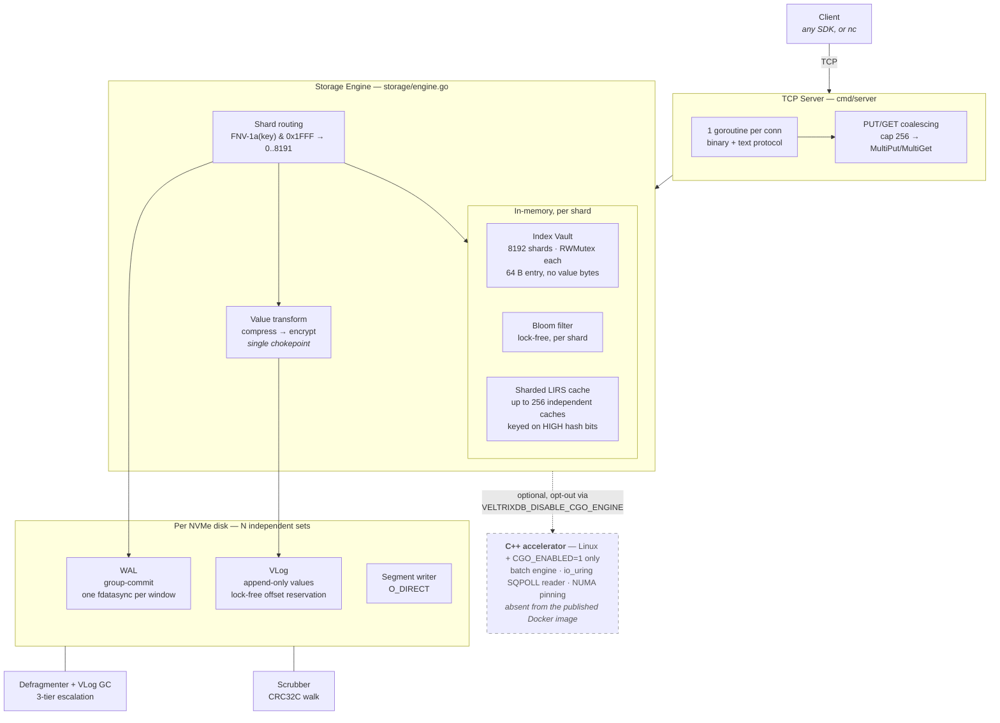
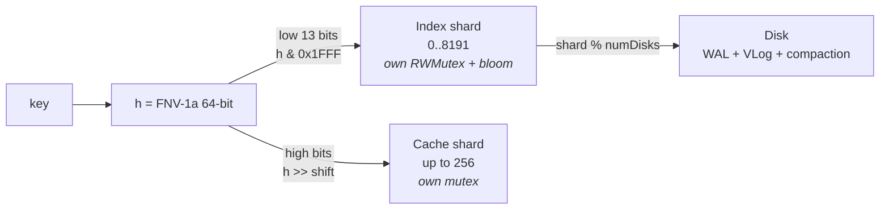
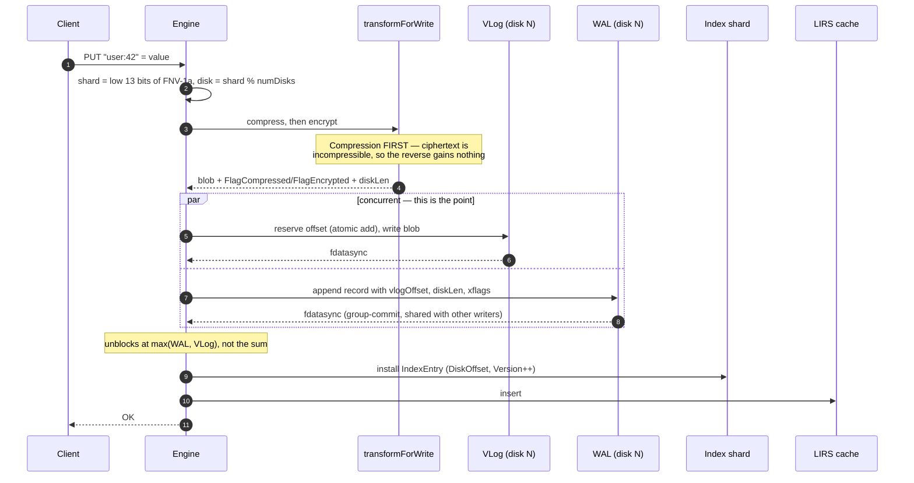
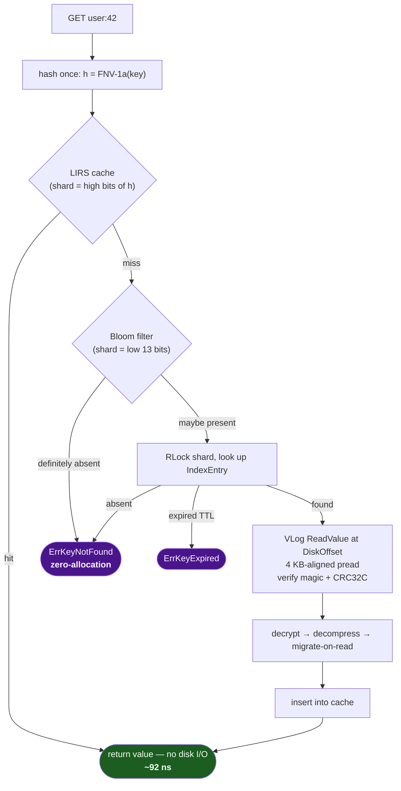

# VeltrixDB Architecture

---

## Overview

Everything on the serving path is Go. The C++ layer is an optional Linux-only
accelerator, and most of what is under `cpp/` has no Go call site at all —
the dashed box below is the honest boundary, not the file tree.



### What is NOT in that diagram

`cpp/` also contains an ART index, a 3-tier priority io_uring scheduler, a C++
VLog, a LIRS cache and a defragmenter — roughly 5,400 lines. They compile and
link, and **nothing in Go calls them**. See [cpp/README.md](cpp/README.md).

---

## Sharding

One 64-bit FNV-1a hash drives three independent placements. They deliberately
read different parts of it, so a key that is hot in one is not systematically
hot in the others.



With 8 disks, 1024 of the 8192 shards land on each. A failure on one disk
doesn't affect the other 7.

The Go `numShards` and the C++ `kNumShards` must stay equal — see invariant 1.
`StorageConfig.NumShards` is **vestigial**: it is defaulted and validated but
nothing reads it, and changing it has no effect.

> **Sizing trap.** Anything sized *per shard* is multiplied by **8192**, not
> 1024. The Bloom default was written as "4 M bits/shard × 1024 shards =
> 512 MB" and actually allocated **4 GB** per engine; two test configs
> repeated the mistake at 256 MB each. Both are fixed — but when you add a
> per-shard allocation, do the arithmetic against 8192.

---

## Key Components

**In-Memory Index** — a hash map per shard. Each entry is ~64 B: disk offset,
disk index, value size, flags, TTL and a monotone version counter. No value
bytes. (The C++ ART tree is *not* wired to Go; see the C++ section.)

**Sharded LIRS Cache** — scan-resistant, with value-aware eviction: small
values (≤ 256 B) get priority 2 vs 1, so they resist eviction. Split across up
to 256 independent caches, **each with its own mutex**.

> This is not a micro-optimisation. `LIRSCache.Get` must take its lock
> *exclusively*, because a read mutates the LIRS state machine. A single
> cache-wide mutex therefore serialised every read in the engine and undid the
> 8192-way index sharding entirely — profiling put **21.7% of total CPU** in
> that one lock, 98.98% of it in `Get`. Sharding took a cache hit from
> **711 ns to 92 ns**. Never collapse it back (invariant 36).
>
> The trade: per-shard budgets are not a global budget, so a skewed keyspace
> can evict from a hot shard while a cold one has room.

**Bloom filters** — one lock-free filter per index shard, atomic `uint64`
words, double-hashed probes. Rebuilt from the live index on every defrag pass,
otherwise deletes would leave bits set forever and the false-positive rate
would climb.

**WAL** — group-commit: N writes share one `fdatasync`. Default 15 ms window.
One WAL per disk.

**VLog** — append-only file per disk. Values live here; only key metadata is
in the index (WiscKey KV separation). Concurrent appends reserve offsets with
an atomic add, so there is no mutex on the write path.

**Block Packing** — batched writes pack up to ~26 records into a 4 KB VLog
block. For 128 B values that is 4096 B → 152 B per record (27× density).
Single `Put` stays on the unpacked lock-free path.

**Value transform** — `transformForWrite` is the single chokepoint for
compress-then-encrypt. Every VLog write path must call it; one that skips it
stores plaintext even with `--encrypt-at-rest` on, and does so *silently*,
because `FlagEncrypted` is per-record so reads simply never decrypt what was
never marked.

---

## Write Path

The ordering matters: **VLog is appended before the WAL**, and the two
`fdatasync` calls race rather than run in sequence. The caller waits for
`max(WAL, VLog)`, not their sum — serialising them doubles P99.



**Crash between the VLog write and the WAL fdatasync**: the offset never
reaches the WAL, so replay never builds an index entry for it. The bytes are
unreferenced garbage that the next GC pass reclaims, and the client never got
an OK. Safe.

**What the WAL record must carry.** Records are binary (`storage/wal_format.go`):
a 48-byte header — magic `0xB1`, flags (tombstone / packed / inline value),
key length, `valueLen`, `diskLen`, plaintext CRC32C, `xflags`, timestamp,
version, `vlogOffset` — then the key, the value if inline, and a CRC32C over
the whole record. The legacy text form is still read (and written under
`--wal-format=text`, for rollback only):

```
timestamp|tombstone|key|valueLen|crc32hex|version|vlogOffset|packed|diskLen|xflags
```

The text form was replaced because keys are arbitrary bytes: one key
containing `|` or `\n` made its record unparseable, and replay stops at the
first unparseable record, so every acknowledged write after it was lost on a
crash restart. Its header was also never checksummed.

Fields 9 and 10 are the ones that were missing before v1.1.0. `valueLen` is
the **plaintext** length; `diskLen` is what actually sits on disk after
compression and encryption; `xflags` carries the transform bits. Replay needs
all three or it rebuilds an entry that reads back ciphertext. Fields 9–10 are
emitted only when they differ from the defaults, so an untransformed record
still writes 8 fields and older binaries can still read it.

---

## Read Path



The hash is computed **once** and threaded through both the cache and the
index lookup. The cache shards on the **high** bits and the index on the low
13, so the two placements stay independent.

Both terminal misses return package-level sentinels (`ErrKeyNotFound`,
`ErrKeyExpired`) rather than `fmt.Errorf`, because formatting the key
allocated on every negative lookup — which dominated the bloom-accelerated
miss path. Match with `errors.Is`.

---

## Durability — and the macOS caveat

`fdatasync` is platform-split, and the two halves are not equivalent:

| Platform | File | Call | Measured cost |
|---|---|---|---|
| Linux | `storage/fdatasync_linux.go` | `syscall.Fdatasync` | real round trip to the device |
| macOS / other | `storage/fdatasync_other.go` | `syscall.Fsync` | **0.020 ms** |
| *(not used anywhere)* | — | `fcntl(F_FULLFSYNC)` | **3.098 ms** |

**On macOS, plain `fsync(2)` returns once the data reaches the drive's
volatile cache — it does not flush that cache.** A macOS build is therefore
*not* crash-safe against power loss, only against process death. Several
comments in this repo used to claim the engine pays `F_FULLFSYNC` at
7–10 ms per sync; it never calls it. Those numbers were quoted in sizing
guidance, so treat any macOS write-throughput figure older than v1.1.0 as
measuring an fsync that did substantially less work than advertised.

This is a **dev-only** concern — the target platform is Linux — but it has
bitten twice. It is why the test suite runs in ~13 s on a laptop and once
took 45 minutes on a CI runner, where `fdatasync` is real (see invariant 40).

---

## Admission Control

Protects reads from being starved by heavy writes:

| Read EWMA | Action |
|-----------|--------|
| < 15 ms | Normal — GC runs at full speed |
| ≥ 15 ms | GC bandwidth capped at 60 MB/s (`gcLatencyThresholdNs`) |
| > 20 ms | GC paused + each PUT sleeps 2 ms (`admissionThrottleNs`) |
| < 10 ms | Everything resumes (`admissionResumeNs`) |
| No reads for 4 min | EWMA treated as stale — GC resumes |

---

## VLog GC Tiers

When garbage builds up, GC escalates automatically to avoid death-spirals:

| Garbage ratio | GC bandwidth | Admission pause honored? | Defrag interval |
|---------------|-------------|--------------------------|-----------------|
| < 30% | no GC | — | — |
| 30–50% | unlimited / 60 MB/s | yes | 120 s |
| 50–65% (critical) | unlimited / 200 MB/s | yes | 60 s |
| ≥ 65% (emergency) | unlimited | **no** | 30 s |

Emergency mode logs `[gc] disk=N EMERGENCY` and increments `veltrixdb_vlog_gc_emergency_runs_total`.

---

## C++ Layer (Linux Only)

The Go layer is fully functional on its own. C++ is an optional Linux accelerator — and **less of it is wired up than the file tree suggests**, so check this table before attributing behaviour to it.

| Component | Source | Reachable from Go? |
|-----------|--------|--------------------|
| **Index Vault (off-heap shard tables)** | `storage/native_index.cpp` | **Yes — default on every cgo build, including macOS** |
| Vectorized batch put | `batch_engine.cpp` | Yes — cgo shim in `storage/` |
| SQPOLL SSTable reader | `uring_reader.cpp` | Yes — cgo shim |
| NUMA thread pinning | `numa_topology.cpp` | Yes — cgo shim |
| 8-ring SQPOLL write bridge | `storage_bridge.cpp` | Yes — via `storage_bridge_capi.h`, CMake static lib |
| ART index | `art.cpp` | **No** — compiled into the CMake lib, but no Go call site |
| Priority io_uring scheduler | `scheduler.cpp` | **No** — same |
| LIRS cache / shard / write path / defragmenter | `lirs_cache.cpp`, `shard.cpp`, `write_path.cpp`, `defragmenter.cpp` | **No** — same |
| C++ VLog reader | `vlog.cpp` | **No** — compiled into the CMake lib, but no Go call site |
| eBPF GC throttle | `ebpf_gc_throttle.cpp` | **No** — same |

Two consequences worth internalising:

- **The Docker image is `CGO_ENABLED=1`** (native index + io_uring bridge). Kubernetes' RuntimeDefault seccomp profile blocks `io_uring_setup`, in which case the bridge does not start and VLog batches use pwrite; the native index needs no privileges. `--build-arg CGO_ENABLED=0` builds the old pure-Go static image.
- **CI job `node-6-cpp` compiles the C++** — the CMake target, the cgo shims, and `scripts/build.sh` end to end — and runs the storage suite with the C++ engine on. `node-5-race` runs the native index under `-race`. Every other job is `CGO_ENABLED=0`.

---

## Network front-ends (`--net`)

`go` (default) is one goroutine per connection and serves everything.
`cpp` / `uring` / `poll` is the C++ front-end in `netfront/`: one event loop
per core, each with its own `SO_REUSEPORT` listener and io_uring (poll()
elsewhere). A loop iteration reaps every completion, parses every complete
frame from every connection, calls Go once (`vxnfExec`) for the whole set, and
submits all sends and receives together — syscalls and Go transitions are per
iteration, not per request. Reads are answered inline; writes run on
goroutines and answer through a queue, and a connection with a write in
flight is not parsed further, so each connection stays strictly ordered.
Serves PUT GET DEL PING MPUT MGET of the binary protocol, standalone mode,
no RBAC; TLS and the text protocol stay on Go.

## Cluster

```
cluster/   partition_map.go    consistent-hash ring (FNV-1a, 64 vnodes/node), epoch fencing
           failure_detection.go heartbeat SUSPECT → FAILED state machine
           gossip.go            TCP gossip listener + digest exchange

replication/ async / quorum / strong replication modes
             vector clocks, anti-entropy, tombstone watermarks

consensus/  Raft — leader election + log replication + snapshots
```

### Deployment modes (`--mode`) — what is actually wired into the serving path

As of the B2 integration, the distributed layer is wired into `cmd/server`
through a **write coordinator** (`cmd/server/coordinator.go`) that fronts the
storage engine.  Every mutating client op (PUT / DELETE / MultiPut / CAS /
INCR / DECR / SETNX / TXN, text and binary protocols) goes through it.

| `--mode` | How writes are handled | Consistency guarantee |
|----------|------------------------|-----------------------|
| `standalone` (default) | Straight to the local engine — byte-for-byte the pre-existing single-node path. No Raft, no replication, no redirects. | Single-node linearizable (one writer, one copy). |
| `raft` | Ops are gob-encoded and submitted to a Raft log (`consensus`), committed by quorum, and applied on every node via a storage-backed FSM (`cmd/server/raft_fsm.go`). Non-leaders reject writes with a `MOVED <leader-addr>` redirect. | **Linearizable writes** (single Raft group, quorum commit). Reads default to local applied state (fast, possibly stale); with `--linearizable-reads`, GET runs the **ReadIndex** fence (`consensus/read_index.go`) — quorum-confirmed, never stale, one heartbeat round-trip per read. |
| `replicated` | The write is applied to the local engine, then handed to the replication engine. The `--consistency` flag decides when the client is ACKed. | Primary-copy durability across N copies; **NOT** linearizable under concurrent writers (no single-writer ordering). Reads are local. |

**`--consistency` (replicated mode):**

- `eventual` (async) — ACK immediately after the local write; replicas catch up in the background.
- `quorum` — ACK only after a majority of replicas (counting the local copy) have applied the write.
- `strong` — ACK only after **all** replicas have applied the write.

`quorum`/`strong` surface `ErrReplicationTimeout` / `ErrQuorumNotReached` to the
client when the required copies cannot be reached (e.g. a strong write with a
majority of replicas down errors instead of silently ACKing).

### Raft FSM & snapshots

`raftFSM` implements `consensus.SnapshotStateMachine`.  `Apply` decodes a write
command and runs the engine's own Put/Delete/atomic/txn method — deterministic
because Raft delivers the identical log order to every node.  Results for ops
that return a value/status (CAS/INCR/SETNX/TXN) are returned to the submitting
client via a per-request result side-channel keyed by a node-unique request id.
`Snapshot`/`Restore` dump and reload the keyspace via the engine's paginated
`ScanCursor`.

### Cluster-aware client & topology

`client.Client` (`client/client.go`) is a real cluster client: it fetches
topology over the storage port (`TOPOLOGY` command, mirrored at
`/admin/cluster`), builds a consistent-hash ring **identical** to the server's
(`cluster.HashKey` + 64 vnodes/node), routes each key to its owner, and follows
`MOVED` redirects to the Raft leader.  `/admin/cluster` reports role, Raft
term/leader, peers, partition epoch, and per-replica replication lag.

### Distributed coverage (B3 phase)

- Namespace (NSPUT/NSDEL/NSDROP), hash-field (HSET/HDEL/HEXPIRE), vector
  (VSET), secondary-index (IDXCREATE/IDXDROP), and list/set
  (LPUSH/RPUSH/LPOP/RPOP/SADD/SREM) writes now route through the coordinator
  in ALL modes: raft replays them deterministically via dedicated FSM ops;
  replicated mode ships their composite-key KV effects as ordinary
  replication traffic (the replica's apply hook also refreshes its in-RAM
  vector index for `@vec/` keys).
- Raft reads: local by default; linearizable via `--linearizable-reads`
  (ReadIndex fence).
- **Auto-rebalance is wired** (`cmd/server/rebalancer.go`): membership
  events (join/leave/fail) trigger ring rebalance + physical key migration
  through the TransferAgent (transfer HTTP listener on clientPort+5;
  disable with `--auto-rebalance=false`).
- Cross-region replication: `cmd/repl-ship` tails `/admin/cdc` live and,
  with `--checkpoint`, replays missed writes (including deletes) through the
  durable `/admin/changes` catch-up feed on restart — zero-loss at
  last-write-wins semantics.

### Remaining gaps

- Replicated-mode secondary-index METADATA (IDXCREATE/IDXDROP) is node-local;
  raft mode replicates it.
- QUERY / RANGE / SCANCUR reads are always local in cluster modes.
- repl-ship has no back-pressure to the source and only LWW conflict
  resolution.
